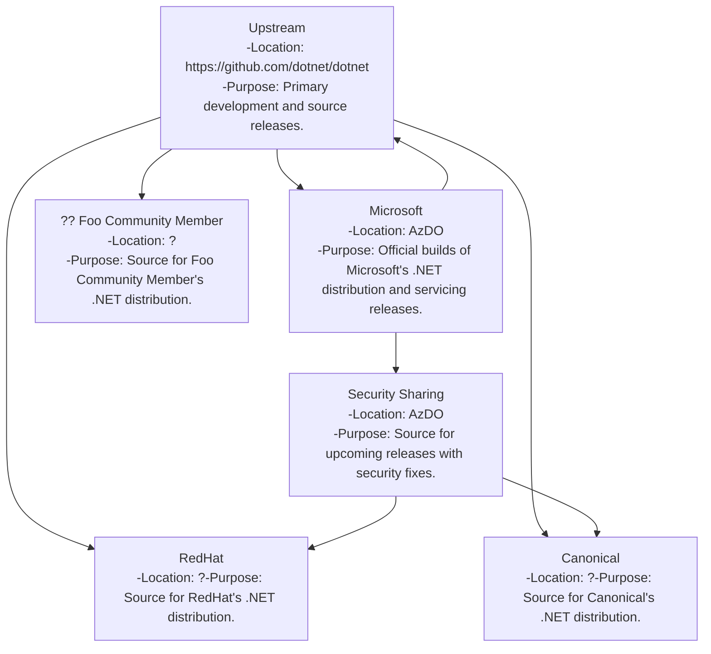

# The Unified Build Almanac (TUBA) - Upstream/Downstream Relationships

## Introduction

Unified Build seeks to enable better product-level upstream/downstream collaboration in the .NET community. To achieve this, it is important that it be possible to maintain a number of inter-related forks and associated branches of .NET. There are two aspects to such an effort:
- Enabling the effective building and management of the product source code via the VMR. 
- Formally identifying the VMRs that could or will exist, their branches, and any associated tagging schemas.

This document focuses on the latter aspect.

## What VMRs exist and what are their relationships?


*VMRs and their relationships. Arrows represent typical code flow.*

Because the VMR enables the organizations other than Microsoft to realistically build a full .NET distribution, it also means that the project can now more closely model typical upstream/downstream collaboration. At least the following VMRs will exist:

- **Upstream**
  - **Location** – ‘dotnet’ Github Organization. (likely https://github.com/dotnet/dotnet)
  - **Maintainer** – Microsoft
  - **Relationship to other VMRs** – Top level upstream
  - **Purpose** - This repository represents the public collaboration location and viewpoint for .NET public servicing, previews, and daily builds. All public releases of Microsoft's .NET distribution will be buildable from a commit in this VMR.
- **Security Sharing**
  - **Location** – Azure DevOps
  - **Maintainer** – Microsoft
  - **Relationship to other VMRs** – Downstream of Upstream and Microsoft
  - **Purpose** – See Dotnet CVE Pre-disclosure Program. The purpose is to provide a location for collaboration with trusted partners on fixes for the pre-disclosure program. Patches for security issues will be applied to this VMR, and trusted partners may pull/cherry-pick into their own VMRs. Trusted partners may also send pull requests for security fixes.
- **Microsoft**
  - **Location** – Azure DevOps
  - **Maintainer** – Microsoft
  - **Relationship to other VMRs** – Downstream of Upstream
  - **Purpose** - Building monthly servicing releases and previews.
- **Non-Microsoft .NET distribution maintainer**
  - **Location** – As appropriate for organization or individual
  - **Maintainer** – Organizations or individuals.
  - **Relationship to other VMRs** – Typically downstream of Upstream.
  - **Purpose** – Maintaining and releasing .NET for customers. Location for interesting projects. Development work.

## Branching and Tagging

For those VMRs that Microsoft is the maintainer, the following branch and tag structures will be used:

### Tags

All releases shall be tagged. This includes public releases as well as internal releases and internal pre-release builds handed to customers for deployment. Shas of builds sent for validation do not need tags.

| **Release Scenario**                                                                | **Tag Format**                       |
|-------------------------------------------------------------------------------------|--------------------------------------|
| Public GA                                                                           | `vMAJOR.MINOR.PATCH`                 |
| Servicing                                                                           | `vMAJOR.MINOR.PATCH`                 |
| Internal/Private GA (stable)                                                        | `vMAJOR.MINOR.PATCH`                 |
| Internal Servicing (stable)                                                         | `vMAJOR.MINOR.PATCH`                 |
| Public Previews                                                                     | `vMAJOR.MINOR.PATCH-previewN`        |
| Internal/Private purpose-specific builds, e.g. Private build for internal customers | `vMAJOR.MINOR.PATCH-private-PURPOSE` |

### Branches

The table below represents branches that are present in various VMRs. Some branches may only be present in some VMRs. Branch names should strive to be consistent across all Microsoft-maintained VMRs.

| **Branch Purpose**                                           | **Present in these VMRs**  | **Changes checked into branch (vs. flowed)** | **‘Primary’ VMR (changes made here, mirrored elsewhere)** | **Format and Example(s)**                                |
|--------------------------------------------------------------|----------------------------|----------------------------------------------|-----------------------------------------------------------|----------------------------------------------------------|
| Mainline development                                         | Upstream, Microsoft       | Public OSS changes                           | Upstream                                                 | main (e.g. main)                                         |
| Public Servicing/RTM sources for a MAJOR.MINOR release       | Upstream, Microsoft       | Public OSS changes approved through Tactics  | Upstream                                                 | release/MAJOR.MINOR (e.g. release/8.0, release/9.0)      |
| Source for next servicing release, including security fixes. | Microsoft,Security Sharing | Security fixes                               | Microsoft                                                 | internal/release/MAJOR.MINOR (e.g. internal/release/8.0) |
| Public preview                                               | Upstream, Microsoft       | Fixes approved through Tactics               | Upstream                                                 | release/MAJOR.MINOR-previewN (e.g. release/8.0-preview1) |
| Public source for RC                                         | Upstream, Microsoft       | Fixes approved through Tactics               | Upstream                                                 | release/MAJOR.MINOR-rcN (e.g. release/9.0-rc1)           |
| Source for RC with security fixes (go-live) | Microsoft, Security Sharing | Security fixes | Microsoft | internal/release/MAJOR.MINOR-rcN (e.g. internal/release/8.0-rc1)
| Preview SDK development post MAJOR.MINOR GA. Has non-SDK components cloaked or inoperable, pre-GA | Upstream, Microsoft | Preview SDK features | Upstream | release/MAJOR.MINOR.SDK_BAND (e.g. release/8.0.2xx) |
| SDK-only VMR branch with security fixes | N/A – Security fixes should not be applied to an SDK-only VMR | | | |

**Note: Addendum at https://dev.azure.com/dnceng/internal/_git/dotnet-eng-wiki?path=/Documentation/unified-build/VMR-Upstream-Downstream-Addendum.md**

## Inter-branch relationships and flow

There is code flow between various branches of the VMR and across various VMR forks. The following code flow methods are used:
- **Direct mirror** - Direct mirrors are used to ensure that the same branch across multiple VMR remotes remains identical. The destination of the mirror shall have no direct check-in. When a commit occurs in the source of the mirror the destination is fast-forwarded to match that commit. If no fast-forward is possible, then the mirror fails and the error should be investigated. Typically, failure is caused by checking into the destination of the mirror.
- **On-demand mirror** - An on-demand mirror is performed when the destination needs updating. This mirror is typically used to update a remote used by partners. The destination is fast-forwarded to ensure matching HEAD commits.
- **PR merge** - A PR merge is used to move fixes between product release lines and ensure that fixes in older releases are not missed in newer releases. When the merge is made, a PR is opened with the changes (and potential merge conflicts) for review and check-in.
- **Merge mirror** - A merge mirror is an automatic mirror between a source and a destination that uses a traditional merge. It’s used in multi-level branch structures and delta branch schemes. Every commit appearing in the source is merged into the destination. It is possible to check-in additional changes in the destination. If the merge fails, then a developer should resolve conflicts.

Using these methods, the following code flow will be used for the product.

```mermaid
flowchart TD
  subgraph Mainline
    UpstreamMain[Upstream\nmain]
    MicrosoftMain[Microsoft\nmain]
    UpstreamPreview[Upstream\nrelease/9.0-preview2]
    MicrosoftPreview[Microsoft\nrelease/9.0-preview2]
    MicrosoftInternalPreview[Microsoft\ninternal/release/9.0-preview2]

    UpstreamPreview-->|'E' PR Merge **|UpstreamMain
    UpstreamPreview-->|'A' Direct Mirror|MicrosoftPreview

    MicrosoftPreview-->|'B' Merge Mirror|MicrosoftInternalPreview
    
    UpstreamMain-->|'A' Direct Mirror|MicrosoftMain
  end
  subgraph Servicing
    Upstream90[Upstream\nrelease/9.0]
    Microsoft90[Microsoft\nrelease/9.0]
    Security90[Securty\ninternal/release/9.0]
    MicrosoftInternal90[Microsoft\ninternal/release/9.0]

    Upstream100[Upstream\nrelease/10.0]
    Microsoft100[Microsoft\nrelease/10.0]
    MicrosoftInternal100[Microsoft\ninternal/release/10.0]
    Security100[Security\ninternal/release/10.0]

    Upstream90-->|'A' Direct Mirror|Microsoft90
    Microsoft90-->|'B' Merge Mirror|MicrosoftInternal90
    MicrosoftInternal90-->|'D' On Demand Mirror|Security90
    MicrosoftInternal90-->|'C' PR Merge on Release Day|Upstream90

    Upstream100-->|'A' Direct Mirror|Microsoft100
    Microsoft100-->|'B' Merge Mirror|MicrosoftInternal100
    MicrosoftInternal100-->|'D' On Demand Mirror|Security100
    MicrosoftInternal100-->|'C' PR Merge on Release Day|Upstream100
  end
  subgraph PreviewSDK
    UpstreamPreviewSdk[Upstream\nrelease/9.0.2xx]
    MicrosoftPreviewSdk[Microsoft\nrelease/9.0.2xx]

    UpstreamPreviewSdk-->|'A' Direct Mirror|MicrosoftPreviewSdk
  end
```


***PR merges might be used to keep mainline up to date with a short-lived preview branch. This will be evaluated at a later time.*

### Desired Flow Rates and Triggers

Based on these flow methods and directions, we can now establish the desired flow for the various VMR branches:

#### *'A'*

- **Description and Purpose**: This flow uses a direct mirror to keep the same branch in two different remotes up to date. Microsoft builds its own .NET distribution from Azure DevOps downstream in [dnceng](https://dev.azure.com/dnceng/internal). This flow keeps Microsoft’s internal copy of the main VMR branch, as well as servicing branches, up to date with the Upstream VMR. A PR is not used.
- **Trigger**: Every commit to the source branch
- **System Responsible**: Maestro Mirror Service

#### *'B'*

- **Description and Purpose**:
  This flow uses a merge mirror to keep a branch up to date with respect to another branch, but allowing for additional commits on the target branch

  This merge is used to keep delta branches up to date in the following scenarios:
  -	Servicing branches (internal/release/MAJOR.MINOR) containing the public servicing bits plus security fixes
  -	Internal private development branches up to date with mainline

- **Trigger**: Every commit to the source branch
- **System Responsible**: Maestro Mirror Service

#### *'C'*

- **Description and Purpose**:
  This flow uses a PR merge to move code from closed to open source. This is typically done on servicing release day for security fixes. The sha in internal/release/MAJOR.MINOR that corresponds to the release (which may not be the same sha in cases of permanent closed source) is merged into the corresponding upstream branch and a PR is opened.

- **Trigger**: Need to open-source internal code (e.g. Servicing Release Day)
- **System Responsible**: Scripting or manual push

#### *'D'*

- **Description and Purpose**:
  This flow uses an on-demand mirror to update the Security fork of the VMR with the source of an upcoming release. The desire is for the shas to match the internal branch exactly, so a fast forward is expected.

- **Trigger**: Sources for next release have been finalized
- **System Responsible**: Scripting or manual push

#### *'E'*

- **Description and Purpose**:
  This flow uses a PR merge to keep a newer line of code up to date with an older line of code. Use of this flow is repository dependent, and inconsistent across the .NET product today. In Unified build, this flow may be used to keep branches of a development repository up to date as desired by owners of those repositories. It is **unlikely** to be in use for the full VMR.

  Between major release, it is unlikely that the source and components between those releases (especially w.r.t. SDKs) will remain consistent enough to allow for easy merges

- **Trigger**: Every commit to source branch
- **System Responsible**: Maestro Mirror Service

**Note: Addendum at https://dev.azure.com/dnceng/internal/_git/dotnet-eng-wiki?path=/Documentation/unified-build/VMR-Upstream-Downstream-Addendum.md**

## Development Repository Branch Flow from Older Releases

.NET tries hard to ensure that newer releases do not miss fixes from older releases. While practices vary per-repo, typically fixes start in the mainline development release, then are back-ported and merged into to servicing releases after organization approval. Some repositories then use inter-branch merging (typically automated) to merge forward from older releases into newer ones, ensuring that the head of a newer release branch (or mainline) contains all shas from older releases. While still possible, this makes it less likely that a fix made exclusively in servicing will fail to make it into the next release.

The development repositories may get flow from older releases in two ways, depending on whether those releases were built on the VMR. *Note: Relying on inter-branch merging to move fixes between releases is fragile and is typically only used to double check work. Repository structures frequently change over time (e.g. coreclr, corefx, and core-setup merge has made merging from dotnet/3.1 to dotnet/5.0 difficult). Even VMR inter-merging will be difficult since SDK bands and components will be added or removed over releases.*

- **VMR Releases** - The VMR *may* use inter-branch merging (see above diagram) to ensure that VMR-built releases and the VMR mainline contain required fixes, though dual check-in should be used in almost all cases. Due to VMR backflow, this means that missed fixes will eventually make it into development repositories once the inter-branch merge reaches the VMR mainline.
  ```mermaid
  flowchart LR
    release100runtime[release/10.0 fix in VMR src/runtime]-->mergeIntoRelease90[Merge into release/9.0 VMR]-->mergeIntoMain[Merge into main VMR]-->backFlow[Back flow into dotnet/runtime]
  ```
- **Pre-VMR releases** – Repositories *may* use inter-branch merging to merge from older isolated servicing repositories into newer releases and onto main. Depending on the extent of changes, re-shuffling of repo sources, etc. this may not always be possible.
  ```mermaid
  flowchart LR
    release80runtime[release/8.0 fix in dotnet/runtime]-->mainRuntime[Merge into main dotnet/runtime on 9.0]-->forwardFlow[Forward flow into VMR]
  ```