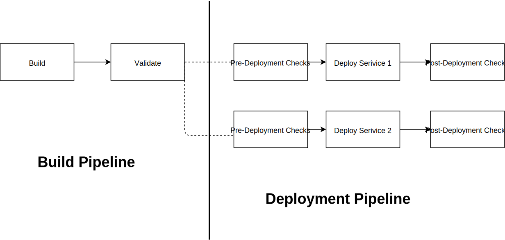
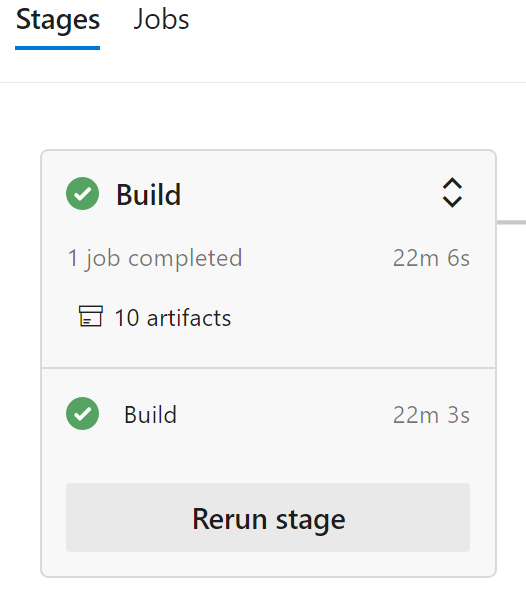

# Deployment Process Overview

Business Requirement: The process for deploying our services use a standard model across all services.

## Consistency in deployment

This epic will define a standard model that we will follow in order to deploy our services. All deployments follow yaml-based stages in pipelines. Ideally all deployments will use the following pattern: 

**Build Pipeline:**

1. Build
    - Build
    - Unit/Functional Tests
    - Publish Build Artifacts
2. Validate
    - SDL Runs
    - Pre-merge checks

**Deployment Pipeline:**

For each of service to be deployed:
- Build Pipeline as a resource:
  Consume a build pipeline as a resource into a deployment pipeline. This way deployments can be kicked-off independent to builds and re-running of just deployments using the same build artifacts is possible as well.
  ```
  resources:
  pipelines:
    - pipeline: MyAppCI
      source: CIPipeline
   -  pipeline: AnotherCI
      source: anotherCIPipeline
   ```
- Download all relevant build artifacts from the attached build pipeline.

The following are the stages in the deployment pipeline and each depends on the previous one to be completed successfully:
1. Pre-deployment checks
2. Deploy service
3. Post-deployment scenario tests

**Production Environments**

Specific to deploying to prod environment is an additional [manual approval check](https://docs.microsoft.com/en-us/azure/devops/pipelines/process/approvals?view=azure-devops#approvals) to prevent accidental deployment. 

**Deployment Workflow**



**Why Stages?**

Stages provide the flexibility of having logical boundaries in pipelines, and can be arranged into a dependency graph (e.g Run Stage B only if Stage A succeeds). Stages also provide the ability to re-run parts of a pipeline; e.g. rerun a failed deployment or run just parts of a deployment which does not require rerunning the entire pipeline. 


