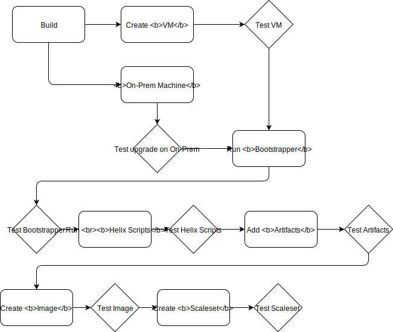

# Validation for OS OnBoarding (OSOB)

## What currently exists for Validation?
The Validations that currently exist in OSOB are:

**PRs**
- Validate whether the yamls are properly constructed ie if the artifacts and Images are correct and they exist.
- Unit level testing with mocks for Scripts and ServiceBus
- Create a test queue for Windows and Centos in staging , deploy the images and artifacts, send a test job to the queue.
(This is broken right now - issue tracked [here](https://github.com/dotnet/core-eng/issues/7984))

**CI**
- Validate whether the yamls are properly constructed ie if the artifacts and Images are correct and they exist.
- Unit level testing with mocks for Scripts and ServiceBus
- Create images, deploy images and artifacts and send jobs to all the queues. 

## What needs to be added?
The common pattern for [Validation](./ValidationProcess.md) and [Deployment](./DeploymentProcess.md) is as below:

**PRs**

1. Build
    - Unit tests
2. Build Image
    - Artifacts
        - Do the artifacts do what they are expected to do?
        - Do the OS specific artifacts do what they are expected to do?
    - Base images from DDFUN
        - Does the image contain the expected OS?
        - Is the correct version of Visual Studio installed? 
        - Is the correct version of other required dependencies installed? 
3. Create Queues
    - Use heuristics based on telemetry to determine which queues need to be spun up for PRs
4. Validate
    - Job sent to all created queues to do minimum base case validation
    - Validate Docker queues (if available)
    - Validate dump collection
    - Helix Scripts
        - Are all environment variables set correctly?
        - Test key functionality (e.g. file uploads, et cetera)

**CI**

Build -> Validate -> Pre-Deployment Checks -> Deploy -> Post-Deployment Checks

The documentations linked above has specific examples for each bucket, for OSOB here is what it should comprise of:
- Validate, such as:
    - Unit/Functional Tests and the validate the yamls for correctness
- Pre-Deployment Checks, such as:
    - Validate if Secrets used are available
- Deploy 
    - Build Images and Deploy Queues
    - Deploy AutoScaleService
- Post-Deployment Checks, such as:
    - Scenario Testing
    - Validate if the version of artifacts installed are what the customer wanted, in the right place with the right permissions.

## Validation Flow

### Test VM

**How it will be tested**: 

**What kinds of functionality will be tested**: Verify OS is correct (e.g. version, language, et cetera)

### Test Upgrade On-Prem

**How it will be tested**: Send a work item to the queue after upgrade is completed. 

    o	Create an on-prem VM
    o	Have Helix download the upgrades package
    o	Have Helix install the artifacts in the package
    o	Check that the version and artifacts match those in the package
    o	This should always run at the end of the "installation" script

**What kinds of functionality will be tested**: Verify version of wheel is as expected

### Test Bootstrapper

**How it will be tested**: 

    o	Create Linux, Windows, Docker, on-prem VMs
    o	Bootstrap downloads and installs the version of Helix based on the queue
    o	Check that the installed Helix is the expected one

**What kinds of functionality will be tested**: Verify version of Helix that was installed is as expected. 

### Test Helix Scripts

**How it will be tested**: 

    o	Create Linux, Windows, Docker, on-prem VMs
    o	Upgrade Helix
    o	Send a work item which will return the version of the wheel or store the version in the heartbeat table and query for the value

**What kinds of functionality will be tested**: Existence of required environment variables

### Test Artifacts

**How it will be tested**: Send in a work item to the queue after artifacts have been added. Similar steps as **Test Upgrade On-Prem**

**What kinds of functionality will be tested**: Verify artifact is correct (e.g. version, et cetera)

### Test Image

**How it will be tested**: 

For On-Prem machine, use VMWare to create an OSX VM an run the OnPrem scripts inside it and make sure that the VM shows in the heartbeat table. 

For VMs, create a VM with the specific version of the image and check if shows up in the heartbeat table.

**What kinds of functionality will be tested**: 

Are the correct VMs being created, meaning, is the VM that is created in this scaleset the one that was defined to be created? 

### Test Scaleset

**How it will be tested**: 

May need to employ telemetry to test this functionality

**What kinds of functionality will be tested**: 

Do these function as expected when an upgrade image is deployed? 

Ensure that work is going to new images even if old images still exist in the queue. 

## OSOB Improvements
The OSOB improvements are covered in detailed [here](../OSOB/OSOBImprovementsWorkPlan.md)

As detailed in the document above, Helix won't be an artifact of an image going forward. With that, we need to validate changes done
to it and any of the scripts and functionality that goes with it. We plan to make the validation "smart" in that we'll run different
tests depending on what is changing. These tests include:

- [On-prem scripts for OSX](https://github.com/dotnet/core-eng/issues/8001)
- [Upgrading Helix client](https://github.com/dotnet/core-eng/issues/8002)
- [Artifact install/upgrades](https://github.com/dotnet/core-eng/issues/8006)
- [Helix bootstrap](https://github.com/dotnet/core-eng/issues/8007)

Additionally, we plan to provide setup scripts so devs can test and validate changes before starting a PR mostly for the scenarios
outlined above. For example, if I made a change in the "upgrades package", we can provide a VM (or set of) where Helix would be
installed and the config(s) set so the correct "upgrade package" is downloaded and installed. With this, the dev could then log
into the machine and validate that the artifacts were installed correctly. Currently tracked by https://github.com/dotnet/core-eng/issues/7999
