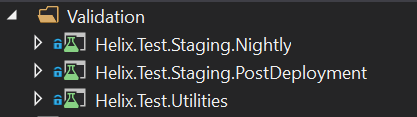

# Validation Principles and Policy

- All code changes (e.g. new features and functionality, refactored code, impact of removed code, et cetera) must be testable in staging.
- All code changes must be described in an issue, including the motivation for the change and links to corresponding pull requests. 
- All test results (including, but not limited to, unit, scenario, functional tests) should be viewable from the same location (e.g. all test results are currently being reported to Azure DevOps Test Results). See section ["Consistency in Reporting"](#consistency-in-reporting) for how this is impelmented. 
- We should strive for 80% code coverage for our unit tests. This give us some leeway when we are dealing with generated code which we may not be able to unit test completely, or if we have some legacy code that cannot be easily unit tested and will need to be covered by functional or scenario tests instead. The goal is to make us think about all the possible code paths, possible corner/edge cases, and different types of data that can be passed into our methods that we will want to validate the outcome of. The code coverage reports can help us determine which code paths were missed in our unit tests so that we can meet (or exceed) the goal of 80% code coverage. 
- Efforts should be made to ["shift left"](https://en.wikipedia.org/wiki/Shift-left_testing) for testing. Therefore: 
  - Developers should validate their changes prior to creating a pull request. This may require testing locally on their dev machine or creating a virtual machine in Azure to test an artifact, et cetera. 
  - Where possible, unit testing should be used. See the [Validation Process](#unit-testing) for guidance for adding unit tests and creating new unit test projects that will hook into pull request and continuous integration job runs.
  - Scenario tests should be written to support testing customer use cases. These can be written as a part of the [post-deployment scenario tests](#post-deployment).
  - If there are known resources that are required for a deployment to be successful, [pre-deployment checks](#pre-deployment) should be written.
  - Functionality that uses dependency injection (DI) requires tests to validate that the dependency injection works.

# Validation Process Overview

Business Requirement: The process for running tests and reporting results uses a standard model across all services

## Validation and Deployment Workflow

Ideal developer workflow from dev environment to production: 
1.  Developer is responsible for writing code for feature, unit/functional tests to cover code written for feature, and expanding on any scenario tests that changes or enhances the way the service works. 
2.  When the feature is completed, the developer should open a pull request that will validate their code. Upon passing validation (and gaining approval on their PR from their peers), the developer should merge into the main branch. 
3.  [Pre-deployment](#pre-deployment) checks on staging should occur to see if the services in staging are healthy for us to deploy to. If not, we should investigate and resolve the problems before we can deploy. 
4.  Code is built from main and deployed to staging.
5.  [Post-deployment](#post-deployment) checks on staging should occur to ensure that the code we deployed is working as intended. 
6.  Similarly, we'll have pre-deployment checks on production prior to deploying our code to production. 
7.  Code is deployed to production. 
8.  Post-deployment validation:
    1.  Similar post-deployment checks on production, if necessary. 
    2.  A [nightly](#nightly) job, currently configured to run only on the staging environment, handles scenario tests that produce more load on our staging environment than we want to be running during regular business hours when staging is used for regular PR and CI jobs. 


## Specific Validation for Services Covered ##

The following links are to documents regarding specifics for validating these services. It includes links to pipelines and jobs, definitions of specific scenarios and things being tested for that service, 

- [Helix Services and API](HelixValidation.md)
- [OS Onboarding](OSOBValidation.md)
- [Arcade](https://github.com/dotnet/arcade/blob/main/Documentation/Validation/Overview.md)
- Arcade Services

## Consistency in Testing Services

All the test projects for all services should exist in the same solution as the service being tested. The following documentation is guidance for how to set up unit tests, scenario tests, and how to categorize tests. 

### Test Categorization

Categorization of our C# tests allow us to streamline the running of tests in our Azure DevOps pipelines. By organizing them this way, we can identify the category of tests that we want to run at a given time. For example, all the tests categorized with `PostDeployment` and `Staging` are configured up to run after a deployment to staging has occurred. 

Adding a category to a test (or a whole test class or test project) in [NUnit](https://github.com/nunit/docs/wiki/Category-Attribute) can be done as follows: 

```
[Category("PostDeployment", "Staging")]
public void TestName...
```

This shows that the test called `TestName` has the categories of `PostDeployment` and `Staging`. If a test run task in Azure DevOps ran either of those categories, it would run that test. If it required both of those categories, it would also run. 

*Note: For [XUnit tests](http://www.brendanconnolly.net/organizing-tests-with-xunit-traits/), you'll need to use the `Trait` attribute instead of `Category`.*

*Note: We currently are supporting both XUnit and NUnit testing frameworks. However, we prefer to use XUnit where possible. NUnit was introduced only to support parallelization for our functional and scenario tests. If neither one of these testing frameworks works for your testing use case, start a discussion with the team to determine a solution. See [this discussion](https://github.com/dotnet/core-eng/pull/8568#discussion_r377821502) for more information.*

The following are categories that have been defined so far, but we are not limited to only using these categories. These categories are not mutually exclusive, so if there are tests that should be run in both Production and Staging, they can be categorized as such. 

#### Pre-Deployment
Criteria: 
- Does the test validate the state of the environment being deployed to? 
- Does the test validate the existence of necessary resources for deployment? 

Examples of pre-deployment scenario tests: 
- Can we connect to the Service Fabric cluster that we need to deploy to?
- Do the secrets we use exist in the appropriate Key Vaults?
- Do the Resource Groups required exist in Azure?

*Category Attribute Value*: `PreDeployment`

#### Post-Deployment
Criteria: 
- Does the test validate the state of the environment after deployment? 
- Does the test require other services in Azure (e.g. Service Bus, Scalesets) to run? 
- Do we not have the ability to run this test locally on a dev environment?

Examples of post-deployment scenario tests: 
- Testing endpoints in Helix API
- Deployed service health check (e.g. are they running, are they returning expected results, et cetera)
- Was the Helix database schema changed appropriately? 

*Category Attribute Value*: `PostDeployment`

#### Nightly
Criteria: 
- Does the test do things that may disrupt normal work? 
- Do we want the test to run on a regular cadence instead of on-demand? 

Examples of nightly scenario tests: 
- Service Fabric Chaos test
- Load testing sending jobs to Helix queues

*Category Attribute Value*: `Nightly`

#### Staging
Criteria: 
- Does the test validate functionality prior to being rolled out to production? 
- Does the test validate the state of the staging environment? 

Examples of staging scenario tests: 
- Testing jobs sent to Helix to validate deployments to staging. We do this on staging only because if we were to run them on Production they would end up behind customer jobs, and customers would catch the bugs before our tests would. 

*Category Attribute Value*: `Staging`

#### Production
Criteria: 
- Does the test monitor or test functionality after it has been deployed to production? 
- Does the test validate the state of the production environment? 

Examples of production scenario tests: 
- Verifying the existence of required resource groups on the Production environment. 
- Tests that would monitor the health of our services and queues (not necessarily tied to a post-deployment scenario).

*Category Attribute Value*: `Production`

### Scenario Tests

Scenario tests are defined as a test that encompasses a full functionality path (which is the scenario). There is an expected outcome for these tests based on the input provided. Usually, these tests will span multiple methods or even services. For example, we can create a test that creates a job, sends the work item to a specific queue, and verifies the job entry in our SQL database. This scenario would test multiple services and functionality in our ecosystem, such as the Helix API, Helix Controller, OS Onboarding, et cetera. 

Scenario tests should encompass things like common functionality used by our customers, functionality that was able to reproduce a problem in our service (e.g. load test that was able to reproduce [the issue](https://github.com/dotnet/core-eng/issues/7548) in AppInsights), et cetera. The tests should be categorized so that they can be run during specific pipelines. These tests are also useful for reproducing issues found by customers and building up a test suite to prevent future regressions, or ensuring that any refactoring that takes place will still provide the same expected result. 

Scenario Test Criteria: 
- The test will cover all the functionality hit during a specific customer scenario. (e.g. Customer sends a job to a specific Helix queue that does some specific work)
- There is an expected result for the test. 
- The test can be repeated with the same expected outcome. 
- Other expected results can be validated (e.g. data sent to SQL or Kusto, state changes for other resources) along the way. 

Scenario test projects should be configured as follows: 

1. Create a folder called `Validation` within the solution for the service. 

2. Create a C# test project for the type of the tests you want to add. Example: 



The project name should include the service being tested, that it is a test project, the environment that will be targeted, and when the tests will run. In the above screenshot, we have `Helix.Test.Staging.Nightly` which denotes that this test project will run nightly on staging for Helix tests. The `Helix.Test.Utilities` project is a helper project that does not contain tests. 

3. Each test project should contain a `AssemblyInfo.cs` file that should contain the Category Attributes for the target environment and when the tests should run. For example, in NUnit: 

```
[assembly: Category("Nightly")]
[assembly: Category("Staging")]
```

### Unit Testing

Unlike scenario tests, [unit tests](https://docs.microsoft.com/en-us/dotnet/core/testing/#what-are-unit-tests) should be targeted to a specific piece of functionality, preferably within a single method. An example of a unit test would be validating that a method that calculates a value does it correctly or that it handles bad input gracefully (or returns some kind of error or other expected response). Unit tests should not require additional services in order to verify the test. Services/resources/classes/modules/et cetera outside the scope of the test should be mocked out. These tests should also be able to be ran locally on any developer's environment. Being able to run the tests locally allows developers to validate that code before committing it to the repository, or have to rely on a pull request to validate their changes. 

When developing unit tests, you may find it appropriate to mock out dependencies to support the test. Our preferred mocking framework is [Moq](https://github.com/Moq/moq4/wiki/Quickstart) for our C# code. You might also find it necessary to use adapter/wrapper patterns to support mocking out dependencies (e.g. see [TelemetryClientProxy.cs](https://dnceng.visualstudio.com/internal/_git/dotnet-helix-service?path=%2Fsrc%2FUtility%2FHelix.Utility.Logging%2FTelemetryClientProxy.cs) class created to support mocking the `TelemetryClient` class from `Microsoft.ApplicationInsights` library.) 

(Dec 12, 2019) Note: These steps have been validated to work in the Helix Services and Arcade Services, and still need to be validated to work with OSOB. 

To add a unit test project, and ensure that it is able to automatically run in the pipelines and have it's test results and code coverage collected, do the following steps: 

1. Create the new test project (using xUnit): Right click on the solution (or folder where you want to add the test project) -> Add -> New Project... -> select xUnit Test Project (.NET Core)


Alternatively, you can create a new project via the dotnet CLI with the command: `dotnet new xunit`

Use the same name as the source project the tests will be for, but with ".Tests" at the end. Based on the Validation process diagram, this project should existing beside the project that it will be testing. This allows for better visibility of the test project in relation to the code it will be testing. 


2. The following package references should be added to the .csproj: 
```
  <PackageReference Include="xunit" />
  <PackageReference Include="xunit.runner.visualstudio" />
  <PackageReference Include="Microsoft.NET.Test.Sdk" />
  <PackageReference Include="Microsoft.CodeCoverage" />
```
3. Rename the namespace of the new test class with the rest of the tests in the solution. Example: 
`Microsoft.Internal.Helix.Utility.Tests`
4. Include the source project to be tested as a project reference: Right click on the test project -> Add -> Reference... -> Select the checkbox for the source project. This is what it would look like in the .csproj file: 
```
  <ItemGroup>
    <ProjectReference Include="..\..\Utility\Helix.Utility.Common\Helix.Utility.Common.csproj" />
  </ItemGroup>
```
5. Ensure that the test project is targeting the correct Target Framework Moniker (TFM). This should be the consistent with the source project's TFM. Example: 
```
  <PropertyGroup>
    <TargetFramework>$(NetFrameworkFramework)</TargetFramework>
  </PropertyGroup>
```
6. Projects that use the .NET Core framework [require an additional property](https://github.com/Microsoft/vstest/issues/800) to ensure the symbols required for code coverage are published. In each source project being tested (not the test project), add the following:
```
  <PropertyGroup>
    <DebugType>Full</DebugType>
  </PropertyGroup>
```
7. Excluding third party libraries from code coverage can be accomplished through [adding a .runsettings file](https://docs.microsoft.com/en-us/visualstudio/test/customizing-code-coverage-analysis?view=vs-2019). This file will need to be referenced in the stage that collects code coverage. The contents of the .runsettings file should look like this: 
```
  <RunSettings>
    <DataCollectionRunSettings>
      <DataCollectors>
        <DataCollector friendlyName="Code Coverage" uri="datacollector://Microsoft/CodeCoverage/2.0" assemblyQualifiedName="Microsoft.VisualStudio.Coverage.DynamicCoverageDataCollector, Microsoft.VisualStudio.TraceCollector, Version=11.0.0.0, Culture=neutral, PublicKeyToken=b03f5f7f11d50a3a">
          <Configuration>
            <CodeCoverage>
              <ModulePaths>
                <Exclude>
                  <ModulePath>.*Moq.dll</ModulePath>
                  <ModulePath>.*fluentassertions.dll</ModulePath>
                  <ModulePath>.*microsoft.extensions.logging.applicationinsights.dll</ModulePath>
                  <ModulePath>.*libgit2sharp.dll</ModulePath>
                  <ModulePath>.*quartz.dll</ModulePath>
                </Exclude>
              </ModulePaths>
            </CodeCoverage>
          </Configuration>
        </DataCollector>
      </DataCollectors>
    </DataCollectionRunSettings>
  </RunSettings>
```

#### Testing BARViz

There is [documentation in Arcade Services](https://github.com/dotnet/arcade-services/tree/master/src/Maestro/maestro-angular) regarding steps to test locally. Also, there is a task in Arcade Services pipeline that will run these tests via `npm test` during PRs/CI. 

Notes: 
- Currently, this process has only been verified to work with xUnit tests. Although we do have nUnit in our codebase, it was introduced to help with parallelization of our functional and scenario tests. 
- Why are the package references in step 2 needed? 
  - **xunit**: used for the xUnit test framework. 
  - **xunit.runner.visualstudio**: required for Visual Studio to run the xunit tests. 
  - **Microsoft.NET.Test.Sdk**: this package (specifically version 15.8.0+) is required so that the `dotnet test` command can collect code coverage during the PR and CI-merge-to-master pipeline runs. 
  - **Microsoft.CodeCoverage**: this package ensures that the CodeCoverage.exe tool will always be available in our builds, especially to help us reduce our dependency on Visual Studio Enterprise. 
- If the repository is using [Arcade](https://github.com/dotnet/arcade), the unit test results will automatically be collected. If it's not, then the build pipeline will require a step to upload the test results. 

## Consistency in Reporting

When our tests fail, we want to be able to see what failure(s) occurred so that we can remediate the issue(s). We want to have a standard way for the tests to report on the test results, and allow us to see the health of our builds and deployments based on the tests that have ran. 

All results from all types of tests should be uploaded to Azure DevOps test results to have a single location to view our test results. Depending on the Azure DevOps task used, the test results may be uploaded to the Test Results automatically. Although it would be ideal for all our services to run tests the same way, it would be unreasonable to expect that because not all our services are engineered the same way (e.g. Arcade-Services uses Arcade's process to build and upload test results, versus Helix Services that makes use of the VSTest Azure DevOps task to run and upload test results). The expectation is that the test results for any test (whether it's unit or scenario) should show up in Azure DevOps Test Results. 

If a project is not set up to run tests, here are some snippets to help incorporate that functionality into the project's Azure DevOps build/test/deploy pipelines: 

### Using VSTest Task
This is a snippet from the Helix Services `deploy-staging.yaml` for running the post-deployment scenario tests. The VSTest task will automatically upload the results from this task to Azure DevOps Test Results. 

This task will run the tests in `Helix.Test.Staging.PostDeployment.dll` with the test categories of `Staging` and `PostDeployment`
```
- task: VsTest@2
  displayName: Post Deployment Scenario Tests
  ...
  inputs:
    testSelector: testAssemblies
    testAssemblyVer2: |
      **\Helix.Test.Staging.PostDeployment.dll
    searchFolder: '$(Pipeline.Workspace)/Deploy_Staging'
    testFiltercriteria: > 
      TestCategory=Staging&
      TestCategory=PostDeployment
    ...
    testRunTitle: Post Deployment Scenario Tests
```

### Using DotNetCoreCLI Task
This is a snippet from the Helix Services `test.yaml` for running the unit tests, and collecting code coverage reports. Tests results from here are not automatically uploaded, so it will require calling the `PublishTestResults` task as well. 

This task will run any test that fits the pattern of `src/**/*.Tests.csproj`, and omits any test that is categorized for `PostDeployment`, `Nightly`, or `PreDeployment`, since we only want unit tests to run in this task. 

```
- task: DotNetCoreCLI@2
  displayName: Test C# (dotnet test)
  inputs:
    command: 'custom'
    projects: 'src/**/*.Tests.csproj'
    custom: 'test'
    arguments: > 
      --configuration $(BuildConfiguration)
      --collect:"Code Coverage"
      --settings:$(Build.SourcesDirectory)/src/CodeCoverage.runsettings
      --filter "TestCategory!=PostDeployment&TestCategory!=Nightly&TestCategory!=PreDeployment"
      --logger trx
      --no-build
  condition: succeededOrFailed()

- task: PublishTestResults@2
  displayName: 'Publish Unit Test Results'
  inputs: 
    testResultsFormat: VSTest
    testResultsFiles: '**/*.trx'
    mergeTestResults: true
    searchFolder: $(system.defaultworkingdirectory)
    testRunTitle: Helix Unit Tests
```

### Code Coverage Reports

Code coverage reports should also be available for PR/CI pipelines and will report on how much code is covered via unit tests (if configured correctly per the guidance above). At the moment, the reports are generated for only C# unit tests, and uses a series of Azure DevOps tasks to complete. The following code snippets are how code coverage is currently set up for our services that employ it's use (as of Jan 10, 2020, Arcade Services and Helix Services). 

*Note: A fair amount of the following was created leveraging information from [this article](https://medium.com/swlh/generating-code-coverage-reports-in-dotnet-core-bb0c8cca66).* 

Code coverage files are collected using the DotNetCoreCLI task. There were some challenges with doing this, namely that we have to use the `custom` command versus `test` as the `test` command does not support code coverage collection. This task will also run and collect unit test results. 
```
- task: DotNetCoreCLI@2
  displayName: Test C# (dotnet test)
  inputs:
    command: 'custom'
    projects: 'src/**/*.Tests.csproj'
    custom: 'test'
    arguments: > 
      --configuration $(BuildConfiguration)
      --collect:"Code Coverage"
      --settings:$(Build.SourcesDirectory)/src/CodeCoverage.runsettings
      --filter "TestCategory!=PostDeployment&TestCategory!=Nightly&TestCategory!=PreDeployment"
      --logger trx
      --no-build
  condition: succeededOrFailed()
```

Next, we need to convert the `.coverage` file that was generated in the previous step to XML. The `convert-codecoveragetoxml.ps1` Powershell script finds the `.coverage` file, and uses `CodeCoverage.exe` to convert to XML. (*Note: This Powershell script file is a custom script that is added to each /eng/ folder in repositories that do this work.*)
```
- task: Powershell@2
  inputs: 
    targetType: 'filePath'
    filePath: eng\convert-codecoveragetoxml.ps1
    arguments: -Path "$(system.defaultworkingdirectory)" -NugetPackagesPath "$(Build.SourcesDirectory)\packages"
  displayName: Convert Code Coverage to XML (powershell)
```

To generate the fancy report, we use the ReportGenerator Azure DevOps plug-in. 
```
- task: Palmmedia.reportgenerator.reportgenerator-build-release-task.reportgenerator@4
  displayName: ReportGenerator
  inputs:
    reports: '$(system.defaultworkingdirectory)\codecoverage.coveragexml'
    targetdir: '$(Build.SourcesDirectory)\CodeCoverage'
    reporttypes: 'HtmlInline_AzurePipelines;Cobertura'
    sourcedirs: '$(Build.SourcesDirectory)'
```

Lastly, we need to upload both the code coverage report that was generated from the previous step and the unit test results from the above test run. 
```
- task: PublishCodeCoverageResults@1
  displayName: 'Publish Code Coverage'
  inputs:
    codeCoverageTool: Cobertura
    summaryFileLocation: '$(Build.SourcesDirectory)\CodeCoverage\Cobertura.xml'
    reportDirectory: '$(Build.SourcesDirectory)\CodeCoverage'
    pathToSources: '$(Build.SourcesDirectory)'
    publishRunAttachments: true

- task: PublishTestResults@2
  displayName: 'Publish Unit Test Results'
  inputs: 
    testResultsFormat: VSTest
    testResultsFiles: '**/*.trx'
    mergeTestResults: true
    searchFolder: $(system.defaultworkingdirectory)
    testRunTitle: Helix Unit Tests
```

#### Code Coverage Reports Locally

To get a report of code coverage locally, you can run the Code Coverage Analyzer from Visual Studio Enterprise. Follow the instructions [here](https://docs.microsoft.com/en-us/visualstudio/test/using-code-coverage-to-determine-how-much-code-is-being-tested?view=vs-2019) for how to run and view code coverage results. 

<!-- Begin Generated Content: Doc Feedback -->
<sub>Was this helpful? [](https://helix.dot.net/f/p/5?p=Documentation%5CValidation%5CREADME.md) [](https://helix.dot.net/f/n/5?p=Documentation%5CValidation%5CREADME.md)</sub>
<!-- End Generated Content-->
