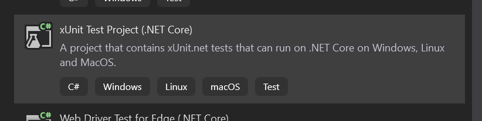
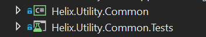

# Validation Process Overview

Business Requirement: The process for running tests and reporting results uses a standard model across all services

Currently, we have tests projects sporadically throughout our projects, no consistency in how the tests are set up, no consistency in where to find results, or guidance on how to add more tests and ensure that they run at the appropriate times. One of the goals of this epic is solve these issues. 

## Consistency in Testing

This epic will define a standard model that we will follow in order to:
- Create new unit, functional/integration, and scenario tests
- Extend the tests that we have
- Hook them into appropriate pipelines or stages so that they can run during PRs/deployments/scheduled jobs

Ideally, the test projects should exist in the same solution with the deployable projects/services. The test projects will be able to be accessed by Azure DevOps pipelines/stages to run during certain events (e.g. PRs, deployments, scheduled jobs). For scenario tests, we can employ the use of categorization so that we can run subsets of the scenario tests in our different pipelines/stages. 

### Scenario Tests

Scenario tests should encompass things like common functionality used by our customers, functionality that was able to reproduce a problem in our service (e.g. load test that was able to reproduce the issue in AppInsights), et cetera. The tests should be categorized so that they can be run during specific pipelines: 

#### Pre-deployment
Examples of pre-deployment scenario tests should include: 
- Can we connect to the Service Fabric cluster that we need to deploy to?
- Do the secrets we use exist in the appropriate Key Vaults?

#### Post-deployment
Examples of post-deployment scenario tests should include: 
- Testing endpoints in Helix API
- Deployed service health check (e.g. are they running, are they returning expected results, et cetera)
- Was the Helix database schema changed appropriately? 

#### Nightly
Examples of nightly scenario test should include: 
- Service Fabric Chaos test
- Load testing sending jobs to Helix queues

## Code Promotion

The gates for code promotion are as follows: 
- **Pull Request for feature branch**: When development code is complete, it should pass checks in the pull request pipeline. If not, it cannot be merged into the master branch. 
- **Post-deployment checks and scenario tests for staging**: When a build is deployed to staging, there will be a suite of tests ran against it. If it does not pass these tests, the code cannot be merged into the production branch. 
- **Post-deployment checks and scenario tests for production**: When a build is deployed to production, there will be a suite of tests ran against it. If it does not pass these tests, a rollback to the previous deployment should occur. 

## Consistency in Reporting

When our tests fail, we want to be able to see what failure(s) occurred so that we can remediate the issue(s). We want to have a standard way for the tests to report on the test results, and allow us to see the health of our builds and deployments based on the tests that have ran. 

## Guidance

Documentation on how to do the above is an absolute must. We want to ensure that other developers can expand upon what we've started, so we will provide guidance with how we expect the test project structure to look like and how to hook them into the pipelines/stages. 

### Unit Testing

(Dec 12, 2019) Note: These steps have been validated to work in the Helix Services and Arcade Services, and still need to be validated to work with OSOB. 

To add a unit test project, and ensure that it is able to automatically run in the pipelines and have it's test results and code coverage collected, do the following steps: 

1. Create the new test project (using xUnit): Right click on the solution (or folder where you want to add the test project) -> Add -> New Project... -> select xUnit Test Project (.NET Core)



Alternatively, you can create a new project via the dotnet CLI with the command: `dotnet new xunit`

Use the same name as the source project the tests will be for, but with ".Tests" at the end. Based on the Validation process diagram, this project should existing beside the project that it will be testing. This allows for better visibility of the test project in relation to the code it will be testing. 



2. The following package references should be added to the .csproj: 
```
  <PackageReference Include="xunit" />
  <PackageReference Include="xunit.runner.visualstudio" />
  <PackageReference Include="Microsoft.NET.Test.Sdk" />
```
3. Rename the namespace of the new test class with the rest of the tests in the solution. Example: 
`Microsoft.Internal.Helix.Utility.Tests`
4. Include the source project to be tested as a project reference: Right click on the test project -> Add -> Reference... -> Select the checkbox for the source project. This is what it would look like in the .csproj file: 
```
  <ItemGroup>
    <ProjectReference Include="..\..\Utility\Helix.Utility.Common\Helix.Utility.Common.csproj" />
  </ItemGroup>
```
5. Ensure that the test project is targeting the correct Target Framework Moniker (TFM). This should be the consistent with the source project's TFM. Example: 
```
  <PropertyGroup>
    <TargetFramework>$(NetFrameworkFramework)</TargetFramework>
  </PropertyGroup>
```
6. Projects that use the .NET Core framework [require an additional property](https://github.com/Microsoft/vstest/issues/800) to ensure the symbols required for code coverage are published. In each source project being tested (not the test project), add the following:
```
  <PropertyGroup>
    <DebugType>Full</DebugType>
  </PropertyGroup>
```
7. Excluding third party libraries from code coverage can be accomplished through [adding a .runsettings file](https://docs.microsoft.com/en-us/visualstudio/test/customizing-code-coverage-analysis?view=vs-2019). This file will need to be referenced in the stage that collects code coverage. The contents of the .runsettings file should look like this: 
```
  <RunSettings>
    <DataCollectionRunSettings>
      <DataCollectors>
        <DataCollector friendlyName="Code Coverage" uri="datacollector://Microsoft/CodeCoverage/2.0" assemblyQualifiedName="Microsoft.VisualStudio.Coverage.DynamicCoverageDataCollector, Microsoft.VisualStudio.TraceCollector, Version=11.0.0.0, Culture=neutral, PublicKeyToken=b03f5f7f11d50a3a">
          <Configuration>
            <CodeCoverage>
              <ModulePaths>
                <Exclude>
                  <ModulePath>.*Moq.dll</ModulePath>
                  <ModulePath>.*fluentassertions.dll</ModulePath>
                  <ModulePath>.*microsoft.extensions.logging.applicationinsights.dll</ModulePath>
                  <ModulePath>.*libgit2sharp.dll</ModulePath>
                  <ModulePath>.*quartz.dll</ModulePath>
                </Exclude>
              </ModulePaths>
            </CodeCoverage>
          </Configuration>
        </DataCollector>
      </DataCollectors>
    </DataCollectionRunSettings>
  </RunSettings>
```

Notes: 
- Currently, this process has only been verified to work with xUnit tests. Although we do have nUnit in our codebase, it was introduced to help with parallelization of our functional and scenario tests. 
- Why are the package references in step 2 needed? 
  - **xunit**: used for the xUnit test framework. 
  - **xunit.runner.visualstudio**: required for Visual Studio to run the xunit tests. 
  - **Microsoft.NET.Test.Sdk**: this package (specifically version 15.8.0+) is required so that the `dotnet test` command can collect code coverage during the PR and CI-merge-to-master pipeline runs. 
- If the repository is using [Arcade](https://github.com/dotnet/arcade), the unit test results will automatically be collected. If it's not, then the build pipeline will require a step to upload the test results. 

## Validation and Deployment Workflow

Ideal developer workflow from dev environment to production: 
- Developer is responsible for writing code for feature, unit/functional tests to cover code written for feature, and expanding on any scenario tests that changes the way the service works. 
- When the feature is completed, the developer should open a pull request to run validate their code and upon passing validation, merge into the master branch. 
- Pre-deployment checks on staging should occur to see if the services in staging are healthy for us to deploy to. If not, we should investigate and resolve the problems before we can deploy. 
- Code is build and deployed to staging.
- Post-deployment checks on staging should occur to ensure that the code we deployed is working as intended. This code is eligible to be merged into the production branch. 
- Similarly, we'll have pre-deployment checks on production prior to deploying our code to production. 
- Code is deployed to production. 
- Similar post-deployment checks on production. 
- Also, a nightly job will run that will handle more intense tests that will require more load than we want to be running during the day. 


