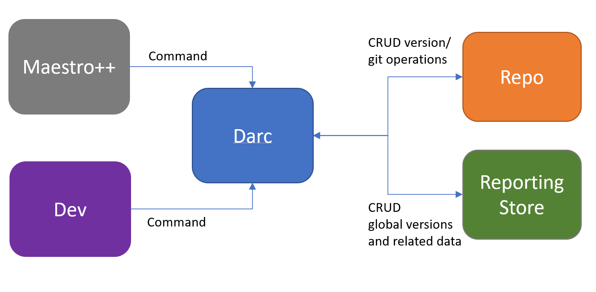

# Querying and updating repo dependencies

## Business Requirement

Know what's in any given product build at any time including versions, SHAs, bits locations, etc.
making the process as seamless as possible and usable by devs and other tools.

## Goal

The main goal of this set of tools is to centralize the way we maintain
the bootstrapping scripts in sync across participating repos and at the
same time have a single way of updating the dependencies on each repo,
keeping track of what’s in each product at all times.

## Description

Maestro++ and Darc will drive the operations in which versions and dependencies
are maintained in sync across repos subscribed to arcade. Darc will serve commands
coming from Maestro++ as well as from a dev in a local repo. Maestro++ will call
Darc when it is triggered by an action that could be: schedule, change in a file or
manually.

## Scenarios

Here I list the top level scenarios which come to mind and try to
describe the required steps to accomplish them:

#### How to update arcade scripts across all repos without using Maestro++

Dev generates a change in arcade by adding, updating or removing a
script. Depending on the operation there is a version which needs to be
updated in participating repos.

For each participant repo:

1. Dev uses Darc to update a dependency in current repo
2. Dev uses Darc to commit and push the update
3. Dev uses Darc to create the Auto-PR
4. Auto-PR is approved and merged by dev

#### How to update a package using Maestro++

1. Maestro++ is triggered by actions such as package publishing and/or
GitHub webhooks monitoring changes in files like bootstrapping scripts
or even when manually triggered
2. Maestro++ uses Darc to determine which files in which repos need to be updated
3. For each repo which needs the update, Maestro++:
    1. Uses Darc to update a dependency in current repo
    2. Uses Darc to commit and push the update
    3. Auto-PR is approved and merged. Initially even though a PR is
    created by Maestro++ it will require a human to approve

#### How to find out who’s using package n, and what versions are out there

1. Dev/Maestro++ uses Darc to query for package n
2. Dev/Maestro++ uses Darc to query for package n’s versions

#### How to determine the versions of the packages contained in a final build

1. Dev/Maestro++ uses Darc to query for build version v
2. Darc returns the dependency graph under build v

## Components

### Darc

A command line tool which performs version operations on .NET Core repos subscribed to arcade. 
Darc knows how to execute git commands on a repo, such as, clone, commit, push, create a PR, etc. And
also the mechanics of reading and writing version information in a repo as well as to query
and update the global version reporting store.  Its functionality is:

#### Input: dependency data

* Query dependencies in `Version.Details.xml`
* Query SHA+repositories for dependencies in `Version.Details.xml`
* Update an entry in `Version.Details.xml` to move a dependency to a new version
* Query the reporting system for SHAs+repositories in which a versioned item was
used
* Query the reporting system for SHAs+repository that produced a versioned item
* Query locations of official assets for a versioned item

You can find more information about dependency descriptions [here](DependencyDescriptionFormat.md)

#### Input: local repository
* Query versioned items in repo's `Version.Details.xml`
* Query SHAs+repositories for dependencies in the repo's `Version.Details.xml`
* Query SHAs+repositories for all downstream dependencies
* Alter the package+version+SHA+repository information in `Version.Details.xml`
    * Add new dependency
    * Change existing dependency
    * Remove dependency

#### Input: SHA+repository
* Query reporting system for versioned items produced by SHA+repository
* Query reporting system for versioned items in which this SHA+repository is referenced
* Query reporting system for SHAs+repositories in which this SHA+repository is referenced

#### Input: package+version
* Query binary (if known format) for SHA+repository

#### Common functionality
* Create source layout for matching versions in repo dependency tree.
* Download product+tools of official build for matching versions, SHA+repository,
package+version

### Darc Vs. Maestro++

Mestro++ based on times or triggers (i.e. a change in a file) flows the new dependency
into subscribed repos using Darc. Main Maestro++ scenario is:

* Identify when there is an update in Arcade’s scripts/dependencies and
    * Add new dependency (using Darc for versions)
    * Change existing dependency (using Darc for versions)
    * Remove dependency (using Darc for versions)
for each participating repo depending on each repo’s subscriptions

<!-- Begin Generated Content: Doc Feedback -->
Was this helpful?  
<!-- End Generated Content-->
