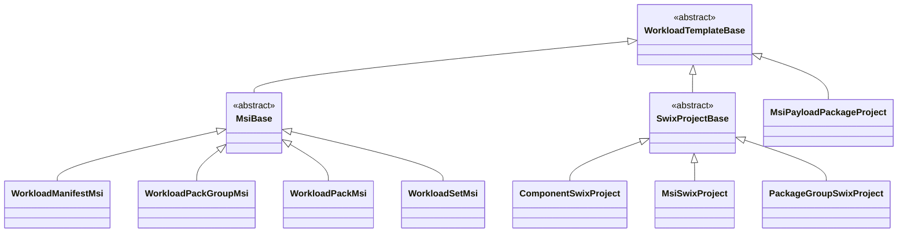

# WorkloadTemplateBase Inheritance Hierarchy

```mermaid
classDiagram
    class WorkloadTemplateBase {
        <<abstract>>
    }

    class MsiBase {
        <<abstract>>
    }

    class SwixProjectBase {
        <<abstract>>
    }

    class MsiPayloadPackageProject

    class WorkloadManifestMsi
    class WorkloadPackGroupMsi
    class WorkloadPackMsi
    class WorkloadSetMsi

    class ComponentSwixProject
    class MsiSwixProject
    class PackageGroupSwixProject

    WorkloadTemplateBase <|-- MsiBase
    WorkloadTemplateBase <|-- SwixProjectBase
    WorkloadTemplateBase <|-- MsiPayloadPackageProject

    MsiBase <|-- WorkloadManifestMsi
    MsiBase <|-- WorkloadPackGroupMsi
    MsiBase <|-- WorkloadPackMsi
    MsiBase <|-- WorkloadSetMsi

    SwixProjectBase <|-- ComponentSwixProject
    SwixProjectBase <|-- MsiSwixProject
    SwixProjectBase <|-- PackageGroupSwixProject
```
